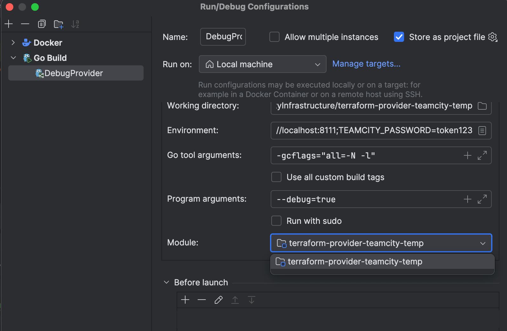

## Local development and contribution

### General guidelines

We have [.junie/guidelines.md](.junie/guidelines.md) file with information for both AI agents and people to quickly
familiarize themselves with the project structure and conventions.


### To debug provider:

1. Run TeamCity server of preferred version via docker-compose.yml file. It should start a TeamCity container with pre-defined token. (There is a `tc-server` run configuration)
2. Open the `DebugProvider` run configuration and make sure the correct module is chosen:
2. Execute in debug mode this `DebugProvider` run configuration. You will see something like:

```
Provider started. To attach Terraform CLI, set the TF_REATTACH_PROVIDERS environment variable with the following:

        TF_REATTACH_PROVIDERS='...'
```

3. In the `examples/0-empty_development` folder export this `TF_REATTACH_PROVIDERS` env variable and you can use `terraform plan/apply`, you dont need to run `terraform init` because it already knows where to get the provider plugin part.

### Run all tests:
* `docker compose up -d --wait --wait-timeout 1000`
```bash
export TEAMCITY_PASSWORD=token123
export TEAMCITY_HOST=http://localhost:8111
export CGO_ENABLED=0
export TF_ACC_PROVIDER_NAMESPACE=jetbrains
export TF_ACC=1

go test -count=1 -v ./...
```

### Debug some test:
There is a GoLand run configuration where you can debug a test package or chose a specific test to run using Pattern like `^\QTestAccProject_basic\E$`:


### Use Swagger UI to work with TeamCity rest API:
When TeamCity server is running, use `Run Swagger UI` configuration and go to http://localhost:8080/

## Contribution

After adding new resources, please add corresponding documentation.

### Generate documentation using tfplugindocs

* We use [tfplugindocs](https://github.com/hashicorp/terraform-plugin-docs) to generate documentation.
* Run it: `tfplugindocs generate --provider-dir .`
* A lot of changes will be made to the documentation files under `docs/`.
* Please commit only related changes to the new resources or changed resources in your pull request.
* IMPORTANT: Examples are not automatically generated. We currently examine each resource manually and add examples right in the generated .md files:
```markdown
## Example Usage

```terraform
resource "teamcity_project" "provider" {
  name = "Project 1"
  parent_project_id = teamcity_project.parent_project.id
}
```
