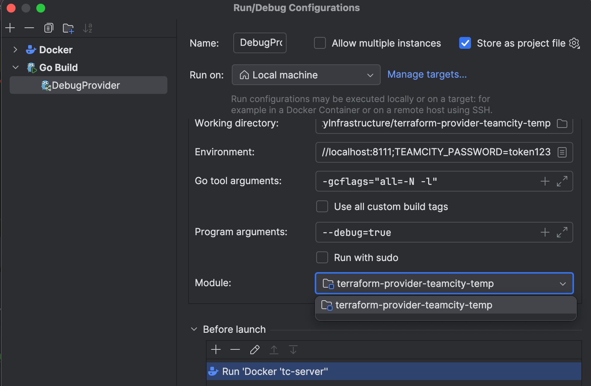
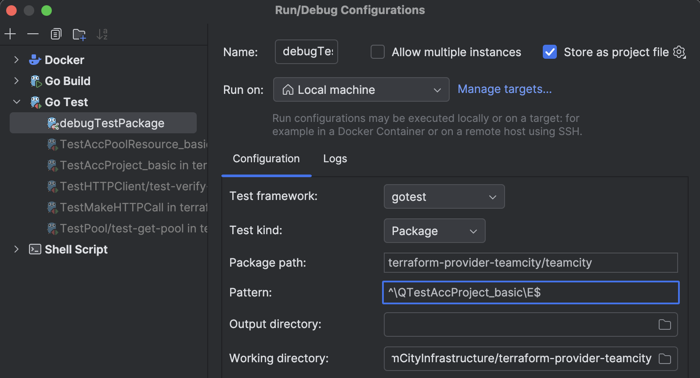

[](https://confluence.jetbrains.com/display/ALL/JetBrains+on+GitHub)
[](https://confluence.jetbrains.com/display/ALL/JetBrains+on+GitHub)

# TeamCity Terraform Provider

This provider leverages the HashiCorp Terraform infrastructure as code approach to allow DevOps engineers to initialize the [JetBrains TeamCity](https://www.jetbrains.com/teamcity/) server and automate its administration.

TeamCity Terraform provider supports Terraform 0.13 and newer.

## Common Information

The TeamCity Terraform Provider allows you to:

* Manage global server settings (server URL, maximum artifact size, VCS polling interval, and more)
* Set up routine server operations like cleanups and email notifications
* Create and manage users, user groups, and permissions
* Set up licenses and authentication modules

See the [Documentation](https://registry.terraform.io/providers/JetBrains/teamcity/latest/docs) for the complete list of available resources and their fields.

In addition, you can include blocks that initialize and set up TeamCity projects, [VCS roots](https://www.jetbrains.com/help/teamcity/configuring-vcs-roots.html#Common+VCS+Root+Properties), and more. However, be aware that the same operations are also available to project administrators via [Kotlin DSL](https://www.jetbrains.com/help/teamcity/kotlin-dsl.html) configuration files.

> We recommend setting some ground rules for your workflow to enforce a single source of truth and avoid conflicting settings from `.tf` and `.kts` configurations. For example, you may want to utilize the Terraform Provider only for the initial TeamCity server setup and global administration, whereas individual projects are managed using Kotlin DSL.

## Initial Setup

Add the TeamCity Terraform Provider to the `required_providers` block of your configuration and specify valid credentials as follows:

```HCL
terraform {
  required_providers {
    teamcity = {
      source = "jetbrains/teamcity"
    }
  }
}

provider "teamcity" {
  host = "http://localhost:8111"
  token = "env.TEAMCITY_TOKEN"
}
```

* `host` — the URL of your TeamCity server
* `token` — the [TeamCity Access Token](https://www.jetbrains.com/help/teamcity/configuring-your-user-profile.html#Managing+Access+Tokens) issued for a user who has sufficient permissions to manage users, projects, and the server itself. It is recommended to store this token in an environment variable instead of passing it as a plain string value.

## Examples

Refer to our [Documentation](https://registry.terraform.io/providers/JetBrains/teamcity/latest/docs) for available resources and configuration samples. 

For more advanced examples, see the `/examples/` folder: 
1. `examples/1-server_settings`
   
    Basic TeamCity server configuration with built-in and GitHub App [authentication](https://www.jetbrains.com/help/teamcity/configuring-authentication-settings.html#Configuring+Authentication), [GitHub connection](https://www.jetbrains.com/help/teamcity/configuring-connections.html#GitHub) and simple [clean up rules](https://www.jetbrains.com/help/teamcity/teamcity-data-clean-up.html).


2. `examples/2-permissions`

    This example demonstrates how to configure [Role](https://www.jetbrains.com/help/teamcity/managing-roles-and-permissions.html) and [User group](https://www.jetbrains.com/help/teamcity/creating-and-managing-user-groups.html) for a [Project](https://www.jetbrains.com/help/teamcity/project.html)


3. `examples/3-project`
   
   A TeamCity [project](https://www.jetbrains.com/help/teamcity/project.html) with [Versioned Settings enabled](https://www.jetbrains.com/help/teamcity/rest/manage-vcs-settings.html), [VCS root](https://www.jetbrains.com/help/teamcity/vcs-root.html) with SSH key and a waiter script to wait for [Kotlin DSL](https://www.jetbrains.com/help/teamcity/kotlin-dsl.html) to be compiled and applied to the project


4. `examples/4-module`
   
   Example with a module used for creating several similar [Projects](https://www.jetbrains.com/help/teamcity/project.html)


5. `examples/5-clone_repos`
   
   Create a new GitHub repository from existing template and add corresponding [Project](https://www.jetbrains.com/help/teamcity/project.html) to TeamCity server.


6. `examples/6-read_repos`
   
   Import all existing GitHub repositories in organisation to TeamCity server creating corresponding [Project](https://www.jetbrains.com/help/teamcity/project.html) for each fo them.


7. `examples/7-import_resources`
   
   Importing existing resources from a running TeamCity instance.

> These samples rely on existing  GitHub organisation, so, they are not easily runnable as is, since the custom GitHub app cannot be re-used, and GitHub provides no API to create it automatically.
Also, all used repositories are created in teamcity-terraform-test organisation.


## License

This project is licensed under the Mozilla Public License 2.0. For more information, please see the LICENSE file.

## Local development and contribution

### To debug provider:

1. Run TeamCity server of preferred version via docker-compose.yml file. It should start a TeamCity container with pre-defined token. (There is a `tc-server` run configuration)
2. Open the `DebugProvider` run configuration and make sure the correct module is chosen:
2. Execute in debug mode this `DebugProvider` run configuration. You will see something like:

```
Provider started. To attach Terraform CLI, set the TF_REATTACH_PROVIDERS environment variable with the following:

        TF_REATTACH_PROVIDERS='...'
```

3. In the `examples/0-empty_development` folder export this `TF_REATTACH_PROVIDERS` env variable and you can use `terraform plan/apply`, you dont need to run `terraform init` because it already knows where to get the provider plugin part.

### Run all tests:
* `docker compose up -d --wait --wait-timeout 1000`
```bash
export TEAMCITY_PASSWORD=token123
export TEAMCITY_HOST=http://localhost:8111
export CGO_ENABLED=0
export TF_ACC_PROVIDER_NAMESPACE=jetbrains
export TF_ACC=1

go test -count=1 -v ./...
```

### Debug some test:
There is a GoLand run configuration where you can debug a test package or chose a specific test to run using Pattern like `^\QTestAccProject_basic\E$`:


### Use Swagger UI to work with TeamCity rest API:
When TeamCity server is running, use `Run Swagger UI` configuration and go to http://localhost:8080/